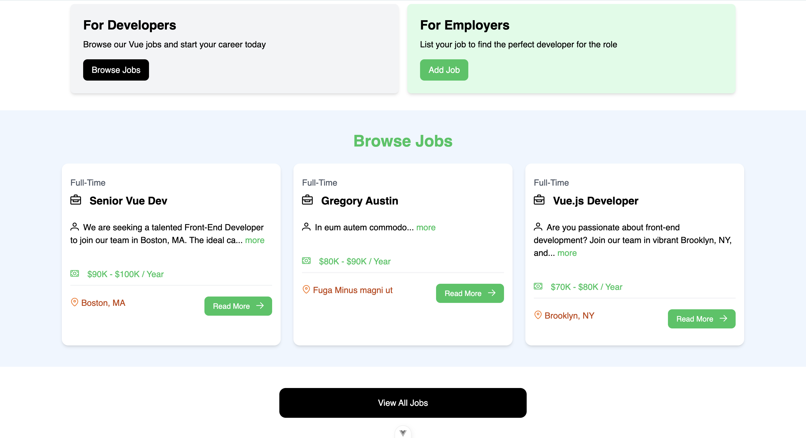
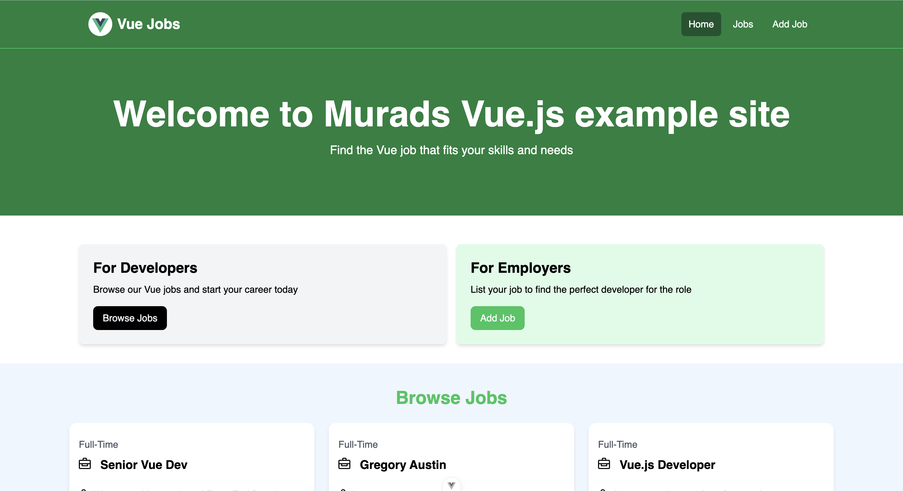
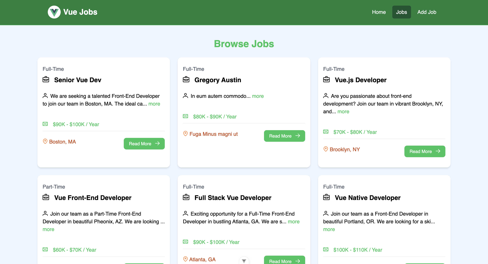
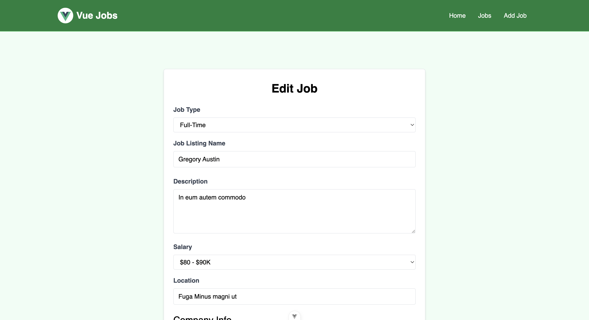

# Vue Jobs Example Site

This project is my first Vue.js project. It is a job board platform built with Vue.js. It allows users to browse, add, and manage job listings. The website is designed to cater to developers looking for Vue.js-related jobs and employers seeking talented Vue.js developers.

## Features

1. **Home Page**:
   - A welcoming banner targeting developers and employers.
   - Two primary actions: "Browse Jobs" for developers and "Add Job" for employers.

2. **Job Listings Page**:
   - Browse a variety of job listings.
   - Each job card displays job title, description, salary, location, and a "Read More" button.

3. **Job Details Page**:
   - Detailed information about the job.
   - Includes company contact details (email and phone).
   - Options to edit or delete the job listing.

4. **Edit Job Page**:
   - Allows employers to update job details, including job type, title, description, salary, location, and company information.

5. **Responsive Design**:
   - The website is optimized for desktop and mobile viewing.

## Screenshots

### 1. Home Page


### 2. Job Listings Page (Expanded View)


### 3. Job Details Page


### 4. Edit Job Page


## How to Run

### Prerequisites
- Node.js and npm installed.
- Vue CLI installed globally.

### Installation
1. Clone this repository:

2. Navigate to the project directory:
   ```bash
   cd vue-jobs-example
   ```

3. Install dependencies:
   ```bash
   npm install
   ```

### Running the Project
This project requires running both the client and the server simultaneously.

1. Start the development server for the client:
   ```bash
   npm run dev
   ```

2. In another terminal, start the backend server:
   ```bash
   npm run server
   ```

3. Open your browser and navigate to:
   ```
   http://localhost:8080
   ```

### Building for Production
To create a production build, run:
```bash
npm run build
```
The output will be in the `dist` directory.

## Technologies Used
- **Vue.js**: JavaScript framework for building user interfaces.
- **Vue Router**: For managing navigation between pages.
- **CSS**: For styling the application.
## Contributing
Contributions are welcome! Please fork this repository and submit a pull request with your improvements.

## License
This project is licensed under the MIT License. See the LICENSE file for details.

## Contact
For any questions or feedback, feel free to reach out:
- **Email**: muradeyvazli18@gmail.com
- **GitHub**: [Murad Eyvazli](https://github.com/DeCaster)
